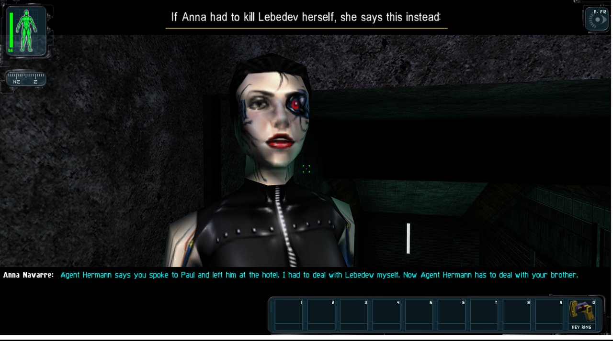
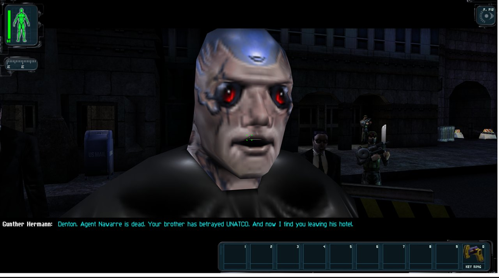
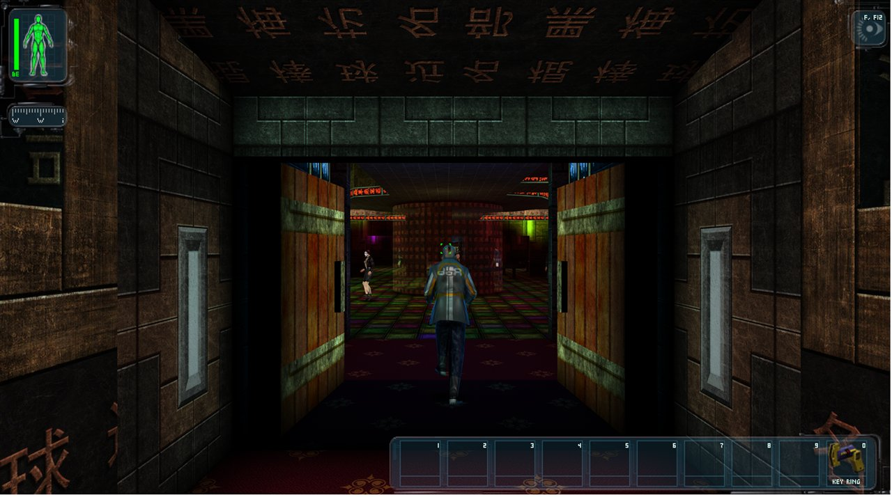
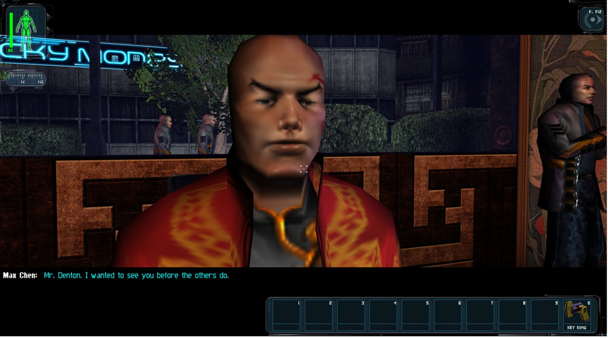
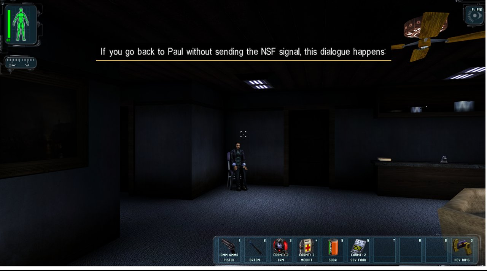

# UNATCO Continues

**A story mod for [Deus Ex: Revision](https://store.steampowered.com/app/397550/Deus_Ex_Revision/).
What if JC Denton had said no to his brother, and stayed with UNATCO?**

In the original game JC leaves UNATCO in mission 4 whatever the player does. This mod
makes that moment a real choice. Refuse Paul at the 'Ton hotel and the story goes on from
there: Gunther arrives for your brother, Anna Navarre watches the subway, Jock flies you to
Hong Kong as a UNATCO agent, the MJ12 helibase welcomes you, the Triads treat you as the
law, and Tracer Tong is no longer your rescuer. He is your assignment.



## What this repository is for

It is the complete working repository of the mod, **open source (MIT)**, published so that
anyone can read it, build it and continue it:

- **the story**, as a [narrative design document](docs/NARRATIVE_DESIGN.md) with every
  line of dialogue the mod adds, its conditions and its variants;
- **how it was made**: the [workflow](docs/WORKFLOW.md) between one person and AI coding
  agents, and the tools written along the way;
- **tutorials** for the techniques that are reusable in other Deus Ex mods;
- **the source**: UnrealScript, build scripts and tools.

**Want to continue it?** Start with [CONTRIBUTING.md](CONTRIBUTING.md) and
[what works and what is next](docs/STATUS.md).

## Status

Work in progress. Playable from the fork at the 'Ton hotel (mission 4) to the end of the
Tracer Tong sequence in Hong Kong. Around 330 new lines of dialogue in 67 conversations.

## What is in the repository

| Path | What |
|---|---|
| `src/UnatcoContinues/Classes` | the mod's code (UnrealScript) |
| `docs/NARRATIVE_DESIGN.md` | premise, writing rules, the full script |
| `docs/WORKFLOW.md` | who does what, the working loop, the tools |
| `docs/tutorials/` | step-by-step guides |
| `docs/*.md` in Italian | the working notes: designs, plans, playtest checklist |
| `tools/` | scripts: game-data readers, map tools, automatic in-game photos, checks |
| `maps/patches/`, `maps/editing/` | the map changes, as patches for your own copy of the maps, and the scripted edits |
| `tools/voices/` | the voice tools (no recordings, no key: you use your own) |
| `build.ps1`, `install.ps1`, ... | build and install scripts (Windows, PowerShell) |

**Not included, on purpose:**

- anything that belongs to Deus Ex or Revision: game files, exported sources, the SDK and
  editor binaries. The mod's map changes are published as **patches** that rebuild the
  maps from your own copy;
- the voice recordings, the samples and the voice identifiers. Every line is in the script
  as text; in game, a line without a recording is shown as a subtitle;
- any key. `tools/voices/elevenlabs_key.example.txt` is a placeholder for your own.

## Requirements

- Deus Ex: Game of the Year Edition and Deus Ex: Revision (Steam).
- To build: the Deus Ex SDK installer, 7-Zip and Python 3, as described in
  [tutorial 1](docs/tutorials/01-setup-build-install.md).

## Quick start

```powershell
.\setup.ps1                              # development copy of the game
python tools\map_patch.py apply-all      # rebuild the modified maps from your own
.\build.ps1 -Isolated                    # compile
.\install.ps1                            # game closed
```

Then, in the game, type `summon UnatcoContinues.UCDbgMenu` in the console once: it starts
the mod and opens the debug jumps. Play from mission 4, or jump straight to a scene.

## Documentation

1. [Narrative design document](docs/NARRATIVE_DESIGN.md) - start here for the story.
2. [Continuing the mod](CONTRIBUTING.md) and [status](docs/STATUS.md)
3. [Workflow and tools](docs/WORKFLOW.md)
4. Tutorials
   - [Setup, build, install](docs/tutorials/01-setup-build-install.md)
   - [Writing a conversation in code](docs/tutorials/02-conversations-in-code.md)
   - [Scenes, flags and the rules of the conversation engine](docs/tutorials/03-scenes-and-flags.md)
   - [Automatic in-game photos](docs/tutorials/04-automatic-photos.md)
   - [Reading maps and game data without the editor](docs/tutorials/05-reading-game-data.md)
   - [The presentation mode used for the video](docs/tutorials/06-presentation-mode.md)

## Screenshots

| | |
|---|---|
|  |  |
|  |  |

## Credits and notice

Made by Gabby ([@Gabby16Bitbox](https://github.com/Gabby16Bitbox)) with AI coding agents
(see the [workflow](docs/WORKFLOW.md)).

This is an unofficial fan project. Deus Ex is a trademark of its owners; Deus Ex: Revision
is the work of Caustic Creative. Nothing from the game or from Revision is distributed
here, and you need to own the game to use the mod.

## Licence

[MIT](LICENSE) for everything written for this project: code, tools, documentation and
dialogue. What the licence does not cover is listed in [NOTICE.md](NOTICE.md).
